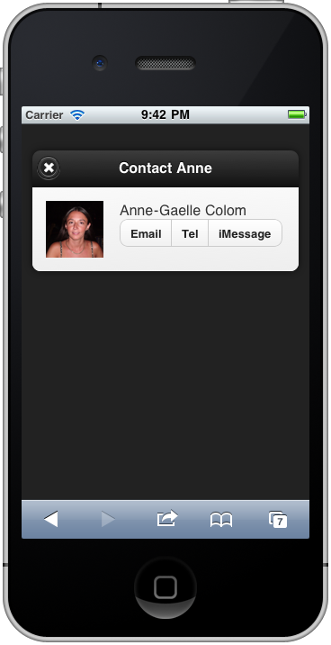

////

Recipe(s) for Dialogs

Author: Anne-Gaelle Colom <coloma@westminster.ac.uk>

////

2.14 Recipe Title
~~~~~~~~~~~~~~~~~~~~~~~~~~~~~~~~~~~~~~~~~~

Problem
++++++++++++++++++++++++++++++++++++++++++++
You want to display a small page to the user in a way that will not look like or behave like a standard page. Instead, you want this to be more like a dialog box. For example, when you click on the second picture <<Fig

[[FIG2-14-1]]
.A Page with a Link with +data-rel="dialog"+
image::images/grid_layout_example.png[]

[[FIG2-14-2]]
.The Dialog Page

Solution
++++++++++++++++++++++++++++++++++++++++++++
Create the page as a standard jQuery Mobile page, and add the data-rel="dialog" attribute to the link to that page: 

[source,html]
<html>
  <head>
    <meta name="viewport" content="width=device-width, initial-scale=1">
    <title>Grid Layout example</title>
    <link rel="stylesheet" href="http://code.jquery.com/mobile/latest/jquery.mobile.css" />
    
    
    
  </head>
  <body>
    

      

        <h4>Choose Contact</h4>
      

      

        <!-- some code here -->

        

        <!-- some code here -->
      
 <!-- /content -->
      

         <h4>My Contacts</h4>
      

    

    

      

        <h1>Contact Anne</h1>
      

      
   
                
        

          <legend>Anne-Gaelle Colom</legend>
          <a href="mailto:coloma@wmin.ac.uk" data-role="button">Email</a>
          <a href="tel:01234567890" data-role="button">Tel</a>
          <a href="sms:coloma@wmin.ac.uk" data-role="button">iMessage</a>
        

      

    

  </body>
</html>

Discussion
++++++++++++++++++++++++++++++++++++++++++++
Anne's picture here is a link to the page with the +id+ +contact_anne+ (Note that the code for the content before and after that picture in the page content container has been removed for clarity). +contact_anne+ is the id of a standard jQueryMobile page which is in the same file as the picture which was clicked, which allows the page to be called by simply linking to its +id+ using the +#id+ key.

By adding the +data-rel="dialog"+ as an attribute to the link to the +contact_anne+ page +id+, the page will not be displayed in full screen like all standard pages. Instead, it will come as a dialog box floating in the middle of the screen. 

It is possible to add a +data-transition+ optional attribute that will define the transition used to bring the dialog box. By default, the reverse set transition is used when leaving the page. In the example above, the transition +"pop"+ was used to open the dialog page. 

Note that it is possible to customise the look of the dialog by setting the +data-overlay-theme+ attribute and/or changing or removing the default 10% top margin.

