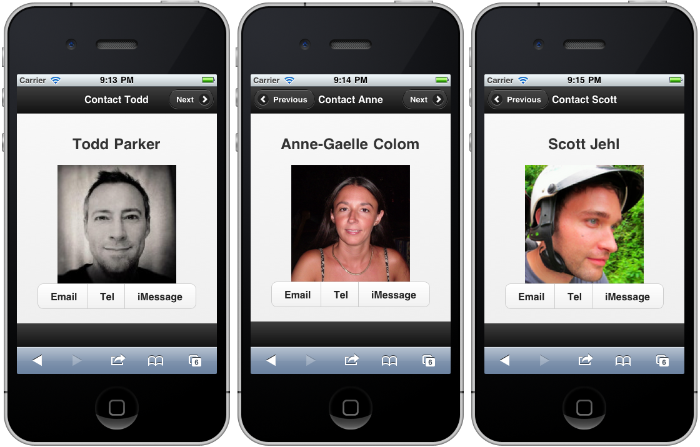

////
XML 2 JQM using XSLT

Author: Anne-Gaelle Colom <coloma@westminster.ac.uk>

TODO: awaiting approval from Scott to use his picture
add discussion
////

2.19 Transforming XML to jQuery Mobile using XSLT
~~~~~~~~~~~~~~~~~~~~~~~~~~~~~~~~~~~~~~~~~~

Problem
++++++++++++++++++++++++++++++++++++++++++++
You have multiple pages that look similar, and it seems inefficient to repeat the same code.

For example, you want to develop a page for each of your contacts where you can just click a button to send them an email, call them or send them an iMessage. You also want to be able to navigate through all those pages, as shown <<FIG2-19-1>>:
[[FIG2-19-1]]
.Navigating through contacts

Solution
++++++++++++++++++++++++++++++++++++++++++++
You can write the content in XML and transform it to jQuery Mobile pages using XSLT. You can then link your XML file and your XSLT file by either adding the reference of the +.xsl+ file on the second line of your XML file, or by using PHP to load both files and do the transformation on the server.

To produce the example described above, it would be inefficient to hardcode all these pages. Instead, you can create an XML file to store your contact details, see <<EX2-19-1>>:

[[EX2-19-1]]
.contacts.xml
<?xml version="1.0" encoding="UTF-8"?>
<?xml-stylesheet type="text/xsl" href="contacts.xsl" ?>
<myContacts>
  <contact>
    <contact_id>contact_1</contact_id>
    <surname>Parker</surname>
    <forename>Todd</forename>
    <shortName>Todd</shortName>
    <picture>todd.jpg</picture>
    <email>xxxx@xxxx.com</email>
    <tel>1234567890</tel>
    <imessage>1234567890</imessage>
  </contact>
  <contact>
    <contact_id>contact_2</contact_id>
    <surname>Colom</surname>
    <forename>Anne-Gaelle</forename>
    <shortName>Anne</shortName>
    <picture>anne.png</picture>
    <email>coloma@wmin.ac.uk</email>
    <tel>1234567890</tel>
    <imessage>coloma@wmin.ac.uk</imessage>
  </contact>
  <contact>
    <contact_id>contact_3</contact_id>
    <surname>Jehl</surname>
    <forename>Scott</forename>
    <shortName>Scott</shortName>
    <picture>scott.png</picture>
    <email>yyyy@yyyy.com</email>
    <tel>1234567890</tel>
    <imessage>1234567890</imessage>
  </contact>
</myContacts>

And then create an XSL file to transform the XML into an HTML that will contain some jQuery Mobile, see <<EX2-19-2>>:

[[EX2-19-2]]
.contact.xsl
<?xml version="1.0" encoding="UTF-8"?>
<!DOCTYPE xsl:stylesheet  [
  <!ENTITY nbsp   "&#160;">
  <!ENTITY copy   "&#169;">
  <!ENTITY reg    "&#174;">
  <!ENTITY trade  "&#8482;">
  <!ENTITY mdash  "&#8212;">
  <!ENTITY ldquo  "&#8220;">
  <!ENTITY rdquo  "&#8221;"> 
  <!ENTITY pound  "&#163;">
  <!ENTITY yen    "&#165;">
  <!ENTITY euro   "&#8364;">
]>
<xsl:stylesheet version="1.0" xmlns:xsl="http://www.w3.org/1999/XSL/Transform">
  <xsl:output method="html" encoding="UTF-8" doctype-public="-//W3C//DTD XHTML 1.0 Transitional//EN" doctype-system="http://www.w3.org/TR/xhtml1/DTD/xhtml1-transitional.dtd"/>
  <xsl:template match="/">
    <html xmlns="http://www.w3.org/1999/xhtml">
      <head>
        <meta http-equiv="Content-Type" content="text/html; charset=UTF-8"/>
        <meta name="viewport" content="width=device-width, initial-scale=1" /> 
        <link rel="stylesheet" href="http://code.jquery.com/mobile/1.1.0/jquery.mobile-1.1.0.min.css"/>
        
        
        <title>MyContacts</title>
        
      </head>    
      <body>
        <xsl:for-each select="myContacts/contact">
          

            <xsl:attribute name="id"><xsl:value-of select="contact_id" /></xsl:attribute>
            

              <xsl:if test="position() != 1" >
                <a data-transition="slide" data-direction="reverse">
                  <xsl:attribute name="href">#<xsl:value-of select="preceding-sibling::contact[1]/contact_id" /></xsl:attribute>
                  <xsl:attribute name="data-direction">reverse</xsl:attribute>
                  <xsl:attribute name="class">ui-btn-left</xsl:attribute>
                  <xsl:attribute name="data-icon">arrow-l</xsl:attribute>
                  <xsl:attribute name="data-iconpos">left</xsl:attribute>
                  Previous
                </a>
              </xsl:if>
              <h1>Contact <xsl:value-of select="shortName" /></h1>
              <xsl:if test="position() != last()" >
                <a data-transition="slide">
                  <xsl:attribute name="href">#<xsl:value-of select="following-sibling::contact/contact_id" /></xsl:attribute>
                  <xsl:attribute name="class">ui-btn-right</xsl:attribute>
                  <xsl:attribute name="data-icon">arrow-r</xsl:attribute>
                  <xsl:attribute name="data-iconpos">right</xsl:attribute>
                  Next
                </a>
              </xsl:if>
            
 <!-- /header -->
            

              <h2><xsl:value-of select="forename" />&nbsp;<xsl:value-of select="surname" /></h2>
              
                <xsl:attribute name="src"><xsl:value-of select="picture"></xsl:attribute> 
              </img>
              

                <a>
                  <xsl:attribute name="href">mailto:<xsl:value-of select="email" /></xsl:attribute>
                  <xsl:attribute name="data-role">button</xsl:attribute>
                  Email
                </a>
                <a>
              <xsl:attribute name="href">tel:<xsl:value-of select="tel" /></xsl:attribute>
              <xsl:attribute name="data-role">button</xsl:attribute>
              Tel
                </a>
                <a>
              <xsl:attribute name="sms">iMessage<xsl:value-of select="imessage" /></xsl:attribute>
              <xsl:attribute name="data-role">button</xsl:attribute>
              iMessage
                </a>
              
               
            
 <!-- /content -->
            

              <h4></h4>
            
 <!-- /footer -->
          
 <!-- page -->
        </xsl:for-each>
      </body>
    </html>
  </xsl:template>
</xsl:stylesheet>

Discussion
++++++++++++++++++++++++++++++++++++++++++++
This is applicable in particular when you have pages describing artifacts or products.  