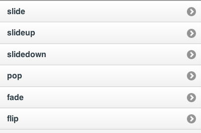

////

Author: Tyson Cadenhead <tcadenhead@appendto.com> 11/29/2012
Chapter Leader approved: <date>
Copy edited: <date>
Tech edited: <date>

////

4.6 Animated Page Transitions 
~~~~~~~~~~~~~~~~~~~~~~~~~~~~~~~~~~~~~~~~~~

Problem
++++++++++++++++++++++++++++++++++++++++++++
Most native applications on mobile devices use fancy transitions between pages to improve their user experience. We need to replicate those transitions to make our experience seem more native.

Solution
++++++++++++++++++++++++++++++++++++++++++++
JQuery Mobile provides a great collection of page transitions out of the box. You can even easily write your own.e.

Discussion
++++++++++++++++++++++++++++++++++++++++++++
JQuery Mobile allows you to add a data-transition attribute to any of your links. The value of the attribute can be "slide", "slideup", "slidedown", "pop", "fade" or "flip". We will create a page that will allow us to sample all of the default jQuery Mobile transitions.

Our code for the list page will look like this:

----
include::recipe-6-code/example.html[]
----

We will also create a subpage with a back button. Since the back button has a data-rel="back" attribute, it will do the transition that the list page used in reverse when you click on it.

----
include::recipe-6-code/subpage.html[]
----

All of the transitions can also be run in reverse by adding data-direction="reverse" to the link.