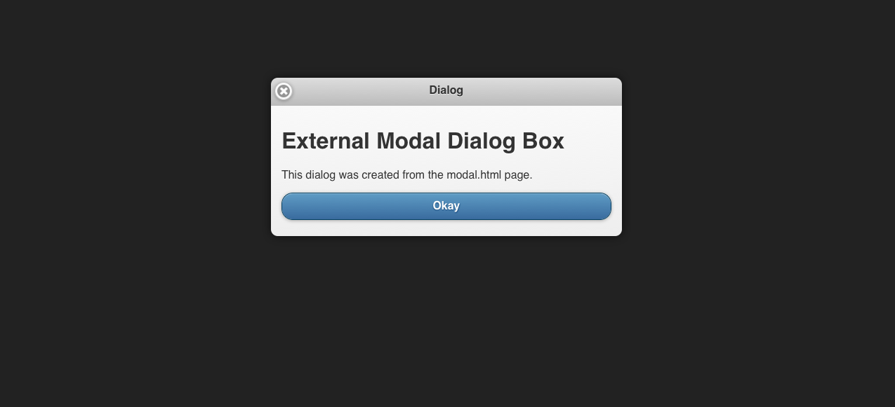

////

Author: Tyson Cadenhead <tcadenhead@appendto.com> 11/28/2012
Chapter Leader approved: <date>
Copy edited: <date>
Tech edited: <date>

////

4.5 Creating Modal Dialogs 
~~~~~~~~~~~~~~~~~~~~~~~~~~~~~~~~~~~~~~~~~~

Problem
++++++++++++++++++++++++++++++++++++++++++++
We want to show a stylish modal dialog box when the user clicks on a button.

Solution
++++++++++++++++++++++++++++++++++++++++++++
JQuery Mobile makes it easy to alert the user with fully styled dialog boxes using any link or button.

Discussion
++++++++++++++++++++++++++++++++++++++++++++
To create a modal dialog, we need to create two pages. The first page will create the button to open the dialog and the second page will be the dialog itself.

Our button page will look something like this:

----
include::recipe-5-code/example.html[]
----

Our dialog page will look like this:

----
include::recipe-5-code/modal.html[]
----

Dialogs basically function as a page within themselves. They can have toolbars like the header in the example above. Any links in the dialog with a data-rel="back" property will close the dialog box.