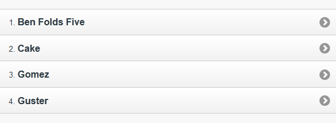

////

This is a comment block.  Put notes about your recipe here and also your author information.

Author: Don Walter <donmwalter@gmail.com>
Bio: Don is an Application and Web Developer living in Villa Hills, KY with his wife and son. You can follow him on Twitter: @donwalter

////

5.1 Building a Basic List
~~~~~~~~~~~~~~~~~~~~~~~~~~~~~~~~~~~~~~~~~~

Problem
++++++++++++++++++++++++++++++++++++++++++++
You may want to display and organize information on your site in a format that is easy for your users to understand and use. 

Solution
++++++++++++++++++++++++++++++++++++++++++++
jQuery Mobile makes it easy to display your information in a mobile-friendly list view. 

Discussion
++++++++++++++++++++++++++++++++++++++++++++
.Basic List
You can easily transform a standard HTML unordered list into a mobile-friendly list element simply by adding `data-inset="true"` attribute to the unordered list element (`<ul>`). jQuery Mobile will add the styling, as well as small arrow icon on the right side of the element to signify that it is a link.

[source, html]
----
<ul data-role="listview">
  <li><a href="band.html">Ben Folds Five</a></li>
  <li><a href="band.html">Cake</a></li>
  <li><a href="band.html">Gomez</a></li>
  <li><a href="band.html">Guster</a></li>
</ul>
----

[[FIG1]]
.Basic List
image::images/5-1-basic.png[]

You can view, run, and modify the above code example from http://jsfiddle.net/gh/gist/jquery/1.7.1/2529294/[jsFiddle].

.Numbered List
The only difference between a regular list view and a numbered list, is that you use an ordered list element (`<ol>`) element instead of an unordered list element (`<ul>`).

[source, html]
----
<ol data-role="listview">
  <li><a href="band.html">Ben Folds Five</a></li>
  <li><a href="band.html">Cake</a></li>
  <li><a href="band.html">Gomez</a></li>
  <li><a href="band.html">Guster</a></li>
</ol>
----

[[FIG1]]
.Numbered List

You can view, run, and modify the above code example from http://jsfiddle.net/gh/gist/jquery/1.7.1/2529949/[jsFiddle].

.Read-Only List
To make a list, just remove any links from the list content. jQuery Mobile will still apply the list styling, without the small arrow icon. This can be useful if you have information you would like to display without having to link the items to other pages. 

[source, html]
----
<ul data-role="listview">
  <li>Ben Folds Five</li>
  <li>Cake</li>
  <li>Gomez</li>
  <li>Guster</li>
</ul>
----

[[FIG1]]
.Read-Only List
image::images/5-1-read-only.png[]

You can view, run, and modify the above code example from http://jsfiddle.net/gh/gist/jquery/1.7.1/2530827/[jsFiddle].