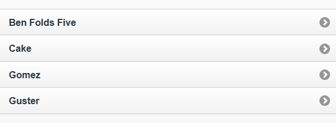
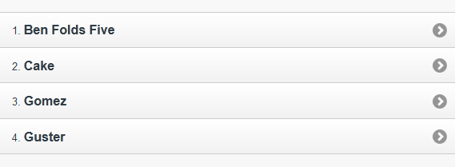
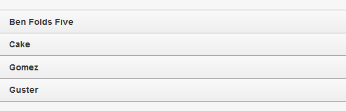

////

Author: Don Walter <don@don-walter.com>
Bio: Don is an Application and Web Developer living in Villa Hills, KY with his wife and son. You can follow him on Twitter: @donwalter

Chapter Leader approved: <date>
Copy edited: <date>
Tech edited: <date>

////

5.1 Building a Basic List
~~~~~~~~~~~~~~~~~~~~~~~~~~~~~~~~~~~~~~~~~~

Problem
++++++++++++++++++++++++++++++++++++++++++++
How can you display information in your application in a way that both looks good on mobile devices and is easy for your users to understand and use?

Solution
++++++++++++++++++++++++++++++++++++++++++++
jQuery Mobile makes it easy to display your information in a mobile-friendly list view. 

Discussion
++++++++++++++++++++++++++++++++++++++++++++
.Basic List
You can easily transform a standard HTML unordered list into a mobile-friendly list simply by adding `data-role="listview"` attribute to an unordered list element (`<ul>`). jQuery Mobile will add the styling, as well as a small arrow icon on the right side of the element to signify that it is a link. When a list item is tapped on, jQuery will issue an AJAX request to the URL of the link inside that list item, create a new page in the DOM from the URL, and then transition you to the newly created page.

[source, html]
----
<ul data-role="listview">
  <li><a href="band.html">Ben Folds Five</a></li>
  <li><a href="band.html">Cake</a></li>
  <li><a href="band.html">Gomez</a></li>
  <li><a href="band.html">Guster</a></li>
</ul>
----

[[FIG1]]
.Basic List

You can view, run, and modify the above code example from http://jsfiddle.net/gh/gist/jquery/1.7.1/2529294/[jsFiddle].

.Numbered List
Sometimes you might want your lists to present items that should be in sequence. By simply changing your unordered list element (`<ul>`) to an ordered list element (`<ol>`), jQuery Mobile will add numbers to your list items.

[source, html]
----
<ol data-role="listview">
  <li><a href="band.html">Ben Folds Five</a></li>
  <li><a href="band.html">Cake</a></li>
  <li><a href="band.html">Gomez</a></li>
  <li><a href="band.html">Guster</a></li>
</ol>
----

[[FIG1]]
.Numbered List

You can view, run, and modify the above code example from http://jsfiddle.net/gh/gist/jquery/1.7.1/2529949/[jsFiddle].

.Read-Only List
You might not always want your lists to be interactive, rather just display your data. If you omit the link in the list item content, your list will still be styled by jQuery Mobile, but remain read-only.

[source, html]
----
<ul data-role="listview">
  <li>Ben Folds Five</li>
  <li>Cake</li>
  <li>Gomez</li>
  <li>Guster</li>
</ul>
----

[[FIG1]]
.Read-Only List

You can view, run, and modify the above code example from http://jsfiddle.net/gh/gist/jquery/1.7.1/2530827/[jsFiddle].