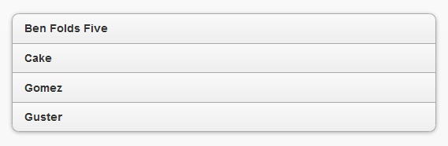
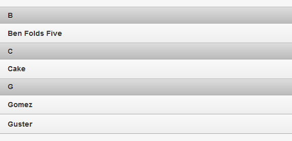
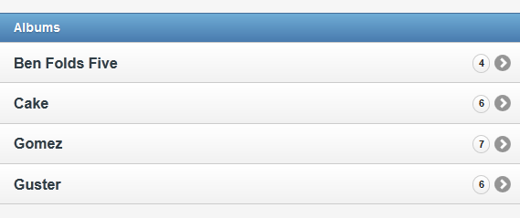
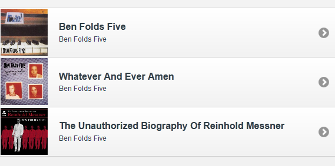
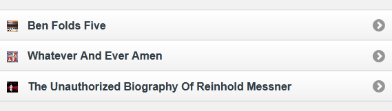
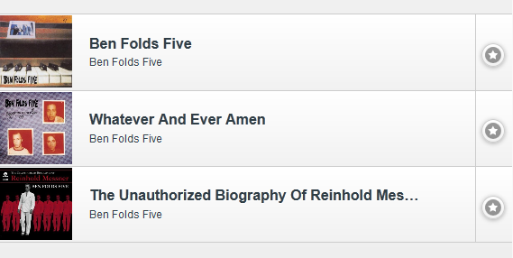

////

This is a comment block.  Put notes about your recipe here and also your author information.

Author: Don Walter <don@don-walter.com>
Bio: Don is an Application and Web Developer living in Villa Hills, KY with his wife and son. You can follow him on Twitter: @donwalter

Chapter Leader approved: <date>
Copy edited: <date>
Tech edited: <date>

////

5.2 Common Formatting of Lists
~~~~~~~~~~~~~~~~~~~~~~~~~~~~~~~~~~~~~~~~~~

Problem
++++++++++++++++++++++++++++++++++++++++++++
By default, jQuery Mobile does a nice job of styling your lists to look nice on mobile devices, but sometimes your application requires a specific appearance. How can we alter the styling of a list and implement some common formatting techniques?

Solution
++++++++++++++++++++++++++++++++++++++++++++
You can apply a variety of formatting options to your lists to both increase readability and add more information. You can apply an inset to your list which will give the list left and right margins, as well as rounded corners. In cases where you might want to have more than one action per list item, you can create a split button list. You can add thumbnails or icons, add count bubbles to show the number of results for a particular list item, add dividers to your list to help separate information, and format your text content in just about any way you want. There are many options to customize your list to suit the data you would like to display.

Discussion
++++++++++++++++++++++++++++++++++++++++++++
.Data Inset
An inset list is just a standard list that sits inside the content area with a margin all the way around, as opposed to the list elements going all the way across the screen. It also adds rounded corners to the list, to help it stylistically fit in better with the other inset elements on the page. To make an inset list, all you need to do is add the `data-inset="true"` attribute to the element (`<ul>` or `<ol>`)

[source, html]
----
<ul data-role="listview" data-inset="true">
  <li>Ben Folds Five</li>
  <li>Cake</li>
  <li>Gomez</li>
  <li>Guster</li>
</ul>
----

[[FIG1]]
.Inset List

You can view, run, and modify the above code example from http://jsfiddle.net/gh/gist/jquery/1.7.1/2519857/[jsFiddle].

.List Dividers
List dividers can be used to help organize and group your list item. To make a list divider, simply add `data-role="list-divider"` to a list item. You can also specify the theme for the divider row by adding `data-dividertheme="d"` attribute to the list (`<ul>` or `<ol>`), and specifying the theme letter you would like to use.

[source, html]
----
<ul data-role="listview" data-dividertheme="d">
  <li data-role="list-divider">B</li>
  <li>Ben Folds Five</li>
  <li data-role="list-divider">C</li>
  <li>Cake</li>
  <li data-role="list-divider">G</li>
  <li>Gomez</li>
  <li>Guster</li>
</ul>
----

[[FIG2]]
.List Dividers

You can view, run, and modify the above code example from http://jsfiddle.net/gh/gist/jquery/1.7.1/2521774/[jsFiddle].

.Count Bubbles
Count bubbles can be helpful when you want your users to be given an indicator of how many results exist for each list item. A count bubble can easily be added by wrapping the count inside a `` tag with a class of `ui-li-count`. jQuery Mobile will wrap the count into a bubble, and align it to the right.

[source, html]
----
<ul data-role="listview">
  <li data-role="list-divider">Albums</li>
  <li><a href="albums.html">Ben Folds Five 4</a></li>
  <li><a href="albums.html">Cake 6</a></li>
  <li><a href="albums.html">Gomez 7</a></li>
  <li><a href="albums.html">Guster 6</a></li>
</ul>
----

[[FIG3]]
.Count Bubbles

You can view, run, and modify the above code example from http://jsfiddle.net/gh/gist/jquery/1.7.1/2521786/[jsFiddle].

.Text Formatting
The jQuery Mobile framework also allows you to easily format your list item content with headers, descriptions, and other secondary information using nothing more than the HTML tags that you already know. You can add headers or paragraphs, make items bold or italicized, or just about any other text formatting you'd like to add.

[source, html]
----
<ul data-role="listview">
  <li data-role="list-divider">Ben Folds Five Songs</li>
  <li>
    <a href="song.html">
      <h3>Jackson Cannery</h3>
      
<em>Album: Ben Folds Five</em>

      
Duration: <strong>3:23</strong>

    </a>
  </li>
  <li>
    <a href="song.html">
      <h3>Evaporated</h3>
      
<em>Album: Whatever And Ever Amen</em>

      
Duration: <strong>4:28</strong>

    </a>
  </li>
  <li>
    <a href="song.html">
      <h3>Eddie Walker</h3>
      
<em>Album: Naked Baby Photos</em>

      
Duration: <strong>3:20</strong>

    </a>
  </li>
</ul>
----

[[FIG4]]
.Text Formatting
image::images/5-2-text-formatting.png[]

You can view, run, and modify the above code example from http://jsfiddle.net/gh/gist/jquery/1.7.1/2521793/[jsFiddle].

.Thumbnails
Thumbnails can easily be added to the left of a list item simply by adding an image inside your `<li>` tag. The jQuery Mobile framework will automatically scale the image to 80px x 80px.

[source, html]
----
<ul data-role="listview">
  <li>
    <a href="details.html">
      
      <h3>Ben Folds Five</h3>
      
Ben Folds Five

    </a>
  </li>
  <li>
    <a href="details.html">
      
      <h3>Whatever And Ever Amen</h3>
      
Ben Folds Five

    </a>
  </li>
  <li>
    <a href="details.html">
      
      <h3>The Unauthorized Biography Of Reinhold Messner</h3>
      
Ben Folds Five

    </a>
  </li>
</ul>
----

[[FIG5]]
.Thumbnails

You can view, run, and modify the above code example from http://jsfiddle.net/gh/gist/jquery/1.7.1/2521798/[jsFiddle].

.Icons
Icons can be inserted to the left of a list item the same way thumbnails can. The only difference is that you need to add a class of `ui-li-icon` to the image element. Icon images do not get auto resized to the correct dimensions, and should be no larger than 16px x 16px for the cleanest appearance.

[source, html]
----
<ul data-role="listview">
  <li>
    <a href="details.html">
      
      Ben Folds Five
    </a>
  </li>
  <li>
    <a href="details.html">
      
      Whatever And Ever Amen
    </a>
  </li>
  <li>
    <a href="details.html">
      
      The Unauthorized Biography Of Reinhold Messner
    </a>
  </li>
</ul>
----

[[FIG6]]
.Icons

You can view, run, and modify the above code example from http://jsfiddle.net/gh/gist/jquery/1.7.1/2521800/[jsFiddle].

.Split Button Lists
Sometimes, you need a list element to have multiple actions assigned to it. Maybe you would like to give your users the ability to view an item's details, or purchase that item, both from the same list element. This can be done with a split button list. To do this, you just need to add a second link inside the `li`, and jQuery Mobile does the rest. You can take this a step further and customize the right split icon, if you'd like. To do this, you just need to add a `data-split-icon` attribute with whatever icon name you'd like to use. You can also theme the split button swatch color with a `data-split-theme` attribute.

[source, html]
----
<ul data-role="listview" data-split-icon="star" data-split-theme="c">
  <li>
    <a href="details.html">
      
      <h3>Ben Folds Five</h3>
      
Ben Folds Five

    </a>
    <a href="purchase.html">Purchase album</a>
  </li>
  <li>
    <a href="details.html">
      
      <h3>Whatever And Ever Amen</h3>
      
Ben Folds Five

    </a>
    <a href="purchase.html" data-rel="dialog" data-transition="slideup">Purchase album</a>
  </li>
  <li>
    <a href="details.html">
      
      <h3>The Unauthorized Biography Of Reinhold Messner</h3>
      
Ben Folds Five

    </a>
    <a href="purchase.html" data-rel="dialog" data-transition="slideup">Purchase album</a>
  </li>
</ul>
----

[[FIG7]]
.Split Button List

You can view, run, and modify the above code example from http://jsfiddle.net/gh/gist/jquery/1.7.1/2521833/[jsFiddle].