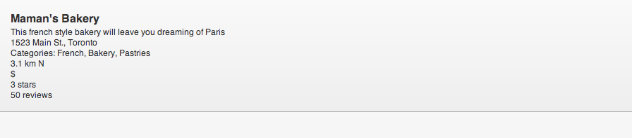
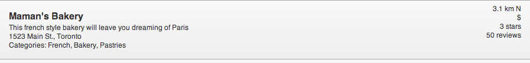
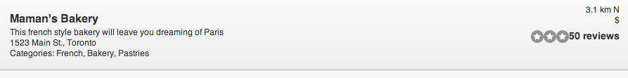
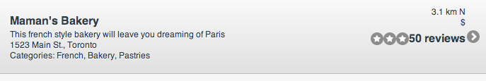
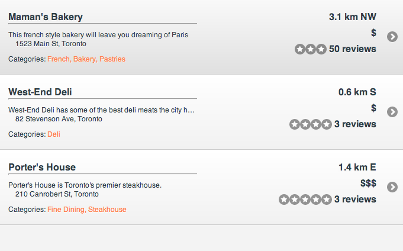

////

This is a comment block.  Put notes about your recipe here and also your author information.

Author: Jason Scott <jasscott@rim.com>

Chapter Leader approved: <date>
Copy edited: <date>
Tech edited: <date>

////

5.3 Custom Formatting of Lists
~~~~~~~~~~~~~~~~~~~~~~~~~~~~~~~~~~~~~~~~~~

Problem
++++++++++++++++++++++++++++++++++++++++++++
You have a lot of information to display or you want to display list items in a unique way to make your application stand out.

Solution
++++++++++++++++++++++++++++++++++++++++++++
You can make a semi-complex list with rich formatting using jQuery Mobile. jQuery Mobile provides some classes to assist with making a custom list but additional CSS will be required. To demonstrate how to build a custom list, let's create the list-view of a Restaurant Locator application.

Discussion
++++++++++++++++++++++++++++++++++++++++++++
The idea behind this Restaurant Locator is that we want to present the user with a list of nearby restaurants.

[source, html]
----
    <ul data-role='list-view'>
        <li><a>Maman's Bakery</a></li>
        <li><a>West-End Deli</a></li>
    </ul>
----

We can just leave it like this and force the user to click each item to find out more. Instead, let's present the user with more information to make a better decision.

Information needed for a Restaurant Locator

* Rating
* Price
* Distance
* Type of cuisine
* Name
* Address

The order of importance may be different for all users but these are the main factors we will use to help them choose.
This may seem like a lot of information for a list item on a mobile screen but fortunately jQuery Mobile gives us some tools to help display it in a usable way. Let's put all of the information elements we are using into a semantic order.

[source, html]
----
    <ul data-role='listview'>
        <li>
            <h1>Maman's Bakery</h1>
            
This French style bakery will leave you dreaming of Paris

            
1523 Main St., Toronto

            
Categories: French, Bakery, Pastries

            
3.1 km N

            
$

            
3 stars

            50 reviews
        </li>
    </ul>
----

To any `h1, h2, h3, h4, h5` that jQuery Mobile finds inside the `li`, it will apply `ui-li-heading`. Also, to any `p`, jQuery Mobile will apply `ui-li-desc`.

This produces the image shown, which has all the information we have but no visual appeal.

[[FIG1]]
.Semantic List Item

Let's change things by moving the distance, price, rating and reviews information to the right. We do that placing each of them in a `div` with the class `ui-li-aside`.

[source, html]
----
    <ul data-role='listview'>
        <li>
            <h1>Maman's Bakery</h1>
            
This French style bakery will leave you dreaming of Paris

            
1523 Main St., Toronto

            
Categories: French, Bakery, Pastries

            

                
3.1 km N

                
$

                
3 stars

                50 reviews
            

        </li>
    </ul>
----
It's already looking better, but still more work to do.

[[FIG2]]
.aside

Next, we will replace "3 stars" with 3 actual stars. This will only work in jQuery Mobile 1.1.1+.

For this, we will use the star icon that can be applied to buttons. Since we do not want a button, we will only make use of its CSS classes `ui-icon-star` and `ui-icon`. We will create an empty `span` for each star in the restaurant's rating. So our code should look like this for our 3 star bakery:

css:

[source, css]
----
    .ui-li-aside span {
        float: right;
    }
----
html:

[source, html]
----
    <ul data-role='listview'>
        <li>
            <h1>Maman's Bakery</h1>
            
This French style bakery will leave you dreaming of Paris

            
1523 Main St., Toronto

            
Categories: French, Bakery, Pastries

            

                
3.1 km N

                
$

                50 reviews
                
                
                
            

        </li>
    </ul>
----

[[FIG3]]
.Stars

Currently the list item is read-only and not selectable. Next, we will make the list items selectable so that the user can get more information about the restaurant. To do this, we wrap the entire contents of the list item with an `a`.

[source, html]
----
    <ul data-role='listview'>
        <li><a href='#'>
            <h1>Maman's Bakery</h1>
            
This French style bakery will leave you dreaming of Paris

            
1523 Main St., Toronto

            
Categories: French, Bakery, Pastries

            

                
3.1 km N

                
$

                50 reviews
                
                
                
            

        </a></li>
    </ul>
----

[[FIG4]]
.Clickable

That's it for jQuery Mobile specific tricks for this tutorial. Let's clean up the rest with standard HTML and CSS.

* Make the Distance and Price larger
* Add color to the different categories
* Fix spacing

[source, css]
----
    div.ui-li-aside {
        float: right;
        margin: 0 1em;
    }
    .ui-li-aside span {
        float: right;
    }
    .address {
        margin-left: 1em;
        margin-bottom: 1.5em;
    }
    .categories {
        color: coral;
    }
    .rating {
        margin-left: .3em;
    }
    .divider {
        margin-top: .1em;
    }
----

[source, html]
----
    <ul data-role="listview">
        <li><a href="#">
            <h1>Maman's Bakery
</h1>
            
This French style bakery will leave you dreaming of Paris

            
1523 Main St, Toronto

            
Categories: French, Bakery, Pastries

            

                <h3>3.1 km NW</h3>
                <h4>$</h4>
                50 reviews
                
                
                
            

        </a></li>
    </ul>
----

Our final product:

[[FIG5]]
.Final

The complete source is available at https://github.com/blackberry/jQuery-Mobile-Samples/

