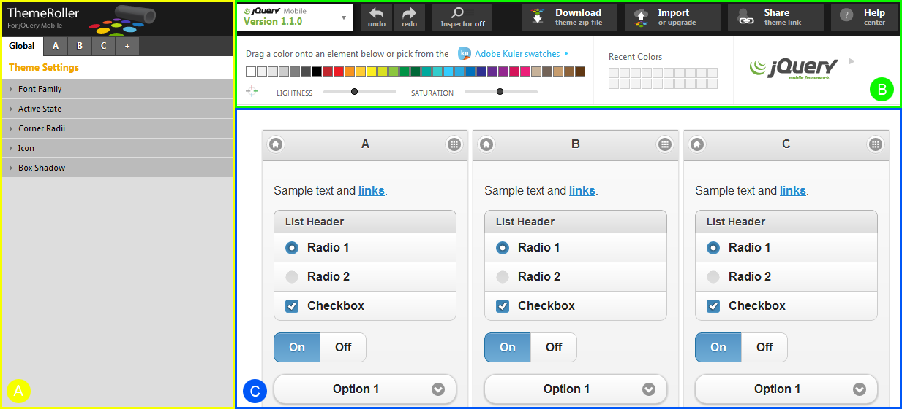
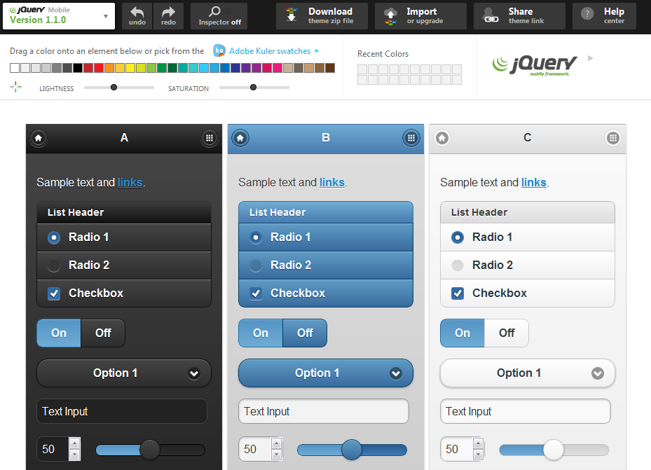
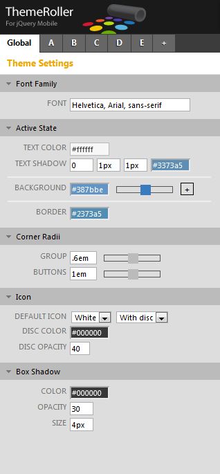
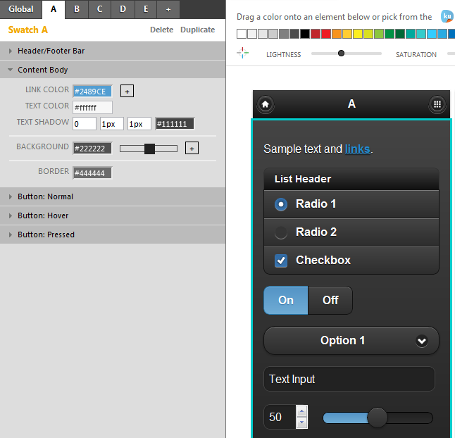

////

This is a comment block.  Put notes about your recipe here and also your author information.

Author: Panagiotis Tsalaportas <sys.sgx@gmail.com>
Chapter Leader approved: <date>
Copy edited: <date>
Tech edited: <date>

////

5.3 The ThemeRoller tool
~~~~~~~~~~~~~~~~~~~~~~~~~~~~~~~~~~~~~~~~~~

Problem
++++++++++++++++++++++++++++++++++++++++++++
You want to create a custom theme fast, without having to deal with CSS code.

Solution
++++++++++++++++++++++++++++++++++++++++++++
The ThemeRoller tool is the easiest way to create custom jQuery Mobile themes. It has 
similar functionality to the jQuery UI ThemeRoller and allows you to customize themes 
through a web interface with instant preview of the changes you make. What's more, it
is open source under the standard jQuery project licenses.

Pages built with jQuery Mobile can have different customized styles with swatches.
_Swatches_ define the look and feel for a bar, a content block, and a button with normal, 
hover and pressed interaction states. Within a single theme, you can create up to 26 swatches 
lettered from A-Z, each one having a unique color scheme.  This lets you combine swatch colors
for different elements in the same web page. For example, if you want to style two
buttons differently in a page, you can assign swatch A to one button and swatch M to the 
other, thus using two different color <schemes class=""></schemes>.

In Figure 6-3.1, we can see the ThemeRoller interface, which is divided in three main areas:

[Figure 6-3.1]

. The *swatches panel* (A) on the left. Through this panel, you can add or modify a swatch, 
and change the global theme settings.
. The *palette panel* (B) at the top right. With the new version of jQuery Mobile 1.1.0, this 
panel has added many new buttons. The main functionality is controlling the inspector and allowing 
for downloading, importing or sharing a link to a theme.
. The *preview panel* (C) on the right, that shows you in real-time each change you make.

Discussion
++++++++++++++++++++++++++++++++++++++++++++
Let's see then how these panels can customize a theme. Note that for the ThemeRoller tool
it is recommended to use a modern web browser that supports CSS gradients, such as the new 
versions of Chrome, Safari and Firefox.

To start with the tool, browse to http://jquerymobile.com/themeroller/. After this page has loaded, 
you will see some sample swatches titled A, B and C in the preview panel, Figure 6-3.1 (C). You can start 
modifying these sample swatches or, in case you already have created a theme file, you can import it and change 
only the things you want. 

As an example, we will import the jQuery Mobile's default theme file. Click on the "Import" button located 
at the palette panel (B). In the new generated window that appears, click the link "Import Default Theme", 
which will load the contents of the default theme file, and then in the same window click the "Import" button. 
Now you can view the loaded default theme styles of all elements in the sample pages at the preview panel, 
Figure 6-3.2, and make modifications.

[Figure 6-3.2]

Swatches Panel
++++++++++++++++++++
The global theme settings of the swatches panel, Figure 6-3.1 (A), can set the _font family_, 
the _active state color_ for page elements, the corner _radii_ for groups and buttons, the 
_icons properties_, and the _box shadow_ styles, as shown in Figure 6-3.3.

[Figure 6-3.3]

Palette Panel
++++++++++++++++++++
The palette panel, Figure 6-3.1 (B), has one of the most useful buttons of the ThemeRoller that adds much 
to its functionality: the Inspector button. Click the Inspector button to activate it; the button's color 
will change indicating its active state. You can toggle the Inspector button so as to use it when you want. 
By hovering over the main content area of swatch A, and you will notice that the current element in "focus" 
gets a border of a different color; this indicates which element of the page the Inspector is currently 
targeting. 

Click, for example, at the main content area, and this will automatically show the configuration 
of Content Body from swatch A at the swatches panel, like in Figure 6-3.4. It is thus possible to modify 
settings such as the background color through the swatches panel. By clicking with the inspector activated 
to different parts of a swatch (i.e., a link or button), you can define all styles applied to it.

[Figure 6-3.4]

An easy way to set colors for elements is to use the color palette, Figure 6-3.1 (B), where you can simply
drag one of the default colors onto an element, or even get new colors by changing the lightness and
saturation. In addition, more colors can be found through the integrated Adobe Kuler Application, which
can be launched by clicking the link "Adobe Kuler swatches". This application is based on the 
Adobe Kuler Community where people share their color palettes for easy integration. 

Preview Panel
+++++++++++++
The preview panel shows in real-time all changes you make to the swatches, Figure 6-3.1 (C). A new swatch 
can be added to the theme through the swatches panel or by clicking "Add swatch" in the preview panel.

Exporting your theme
^^^^^^^^^^^^^^^^^^^^
After you have made the changes you want to your theme, you can download it with the "Download Theme"
button in the swatches panel or share a link of its current configuration. Enter a name for your 
theme, Figure 6-3.5, and follow the instructions provided on the new window to include it in your HTML page. 
It should be mentioned that you should keep the uncompressed CSS version of your theme file, because you can 
edit your theme in the future only by using this file.

[Figure 6-3.5]
image::images-themeroller/theme.png[]
