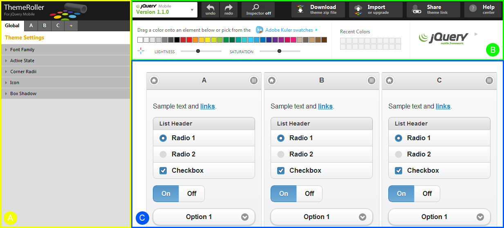
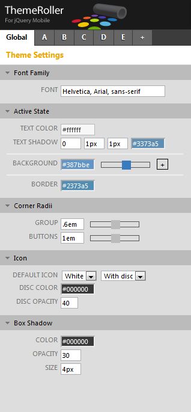

////

This is a comment block.  Put notes about your recipe here and also your author information.

Author: Panagiotis Tsalaportas <sys.sgx@gmail.com>

////

#.# The ThemeRoller tool
~~~~~~~~~~~~~~~~~~~~~~~~~~~~~~~~~~~~~~~~~~

Problem
++++++++++++++++++++++++++++++++++++++++++++
You want to create a custom themes fast, without having to deal with CSS code.

Solution
++++++++++++++++++++++++++++++++++++++++++++
The ThemeRoller tool is the easiest way to create custom jQuery Mobile themes. It has 
similar functionality with the jQuery UI ThemeRoller, and allows you to customize themes 
through a web interface with instant preview of the changes you make. What is more, it
is open source under the standard jQuery project licences.

Pages built with jQuery Mobile can have different customized styles with swatches.
_Swatches_ define the look and feel for a bar, a content block, and a button with normal, 
hover and pressed interaction states. Within a single theme, you can create up to 26 swatches 
lettered from A-Z, each one having a unique color scheme.  This lets you combine swatch colors
for different elements in the same webpage; for example, in case you want to style two
buttons differently in a page, you can assign swatch A to one button and swatch M to the 
other, thus using two different color <schemes class=""></schemes>

In Figure 6-3.1. we can see the ThemeRoller interface, which is divided in three main areas:

. The *swatches panel* (A) on the left. Through this panel, you can add or modify a swatch, 
and change the global theme settings.
. The *palette panel* (B) at the right-top. With the new version of jQuery Mobile 1.1.0 this 
panel has added many new buttons. The main functionality is controling the inspector and allowing 
for downloading or importing a theme.
. The *preview panel* (C) on the right, that shows you in real-time each change you make.

Discussion
++++++++++++++++++++++++++++++++++++++++++++
Let's see then how the above panels can customize a theme. Note that for the ThemeRoller tool
it is recommended to use a modern web browser that supports CSS gradients, such as the new 
versions of Chrome, Safari and Firefox.

Browse to http://jquerymobile.com/themeroller/. After this page has loaded, you will see some 
sample swatches A, B, and C. You can start modifying these sample swatches, or in case you already 
have a theme file you can import it and change only the things you want. As an example, here we will 
import the jQuery Mobile's default theme file; click on the link "Import", located on the top of the
swatches panel and then in the new window click the link "Import Default Theme", which will load
the contents of the default theme file. Now you can view the style of all elements inside the sample
pages of the preview pane, and modify the theme using the panel areas.

Swatches Panel
++++++++++++++
The global theme settings of the swatches panel, shown in Figure 6., can set the _font family_, 
the _active state color_ for page elements, the corner _radii_ for groups and buttons, the 
_icons properties_, and the _box shadow_ styles.

Before using the inspector, click tab A next to the Global tab, to set the current working swatch.

Palette Panel
++++++++++++++
From the palette panel, shown in Figure 6., click button "On" to enable the Inspector. Hover over
the main content area of swatch A, as in Figure 6., and click in it; this will automatically show
the configuration of Content Body from swatch A at the swatches panel, Figure 6. It is thus possible
to modify settings such as the background color. By clicking with the inspector to different parts
of a swatch, you can define all styles applied to it.

An easy way to set colors for elements is to use the color palette, Figure 6., where you can simply
drag one of the default colors onto an element, or even get new colors by changing the lightness and
saturation. In addition, more colors can be found through the integrated Adobe Kuler Application, that
can be launched by clicking the link "Adobe Kuler swatches". This application, is based on the 
Adobe Kuler Community where people share their color palletes for easy integration.

Preview Panel
+++++++++++++
The preview panel shows in real-time all changes you make to the swatches. A new swatch can be added to 
the theme through the swatches panel or by clicking "Add swatch" in the preview panel.

Exporting your theme
^^^^^^^^^^^^^^^^^^^^
After you have made the changes you want to your theme, you can download it with the "Download Theme"
button in the swatches panel. Enter a name for your theme, and follow the instructions provided on the
new window to include it in your HTML page.
