////

Author: Cory Gackenheimer <cory.gack@gmail.com>

How to create form elements in jQuery Mobile

Chapter Leader approved: <date>
Copy edited: <date>
Tech edited: <date>

////

7.2 Creating form elements in jQuery Mobile
~~~~~~~~~~~~~~~~~~~~~~~~~~~~~~~~~~~~~~~~~~~

Problem
+++++++
Form elements are a critical part to building interactions within any web application. Creating form elements that allow intuitive touch interaction on mobile devices is a challenging task to any web developer creating an application in the mobile space.

Solution
++++++++
jQuery Mobile solves the problem of mobile interaction by creating a full featured set of touch input optimized controls. These controls are extensions of the native form elements, enhanced within jQuery Mobile in order to provide your users with the mobile friendly elements. Because these semantically built elements are progressively enhanced from the native form elements, developers can be assured that even if the target device does not fully support jQuery Mobile, your site will maintain functionality. As you build your jQuery Mobile application you will undoubtedly add form elements as you build it. The discussion that follows is a resource to show you the basic usage for each type of form element that is enhanced by jQuery Mobile. You will also find an example of what the enhance version should look like. Also included is an overview of the extra data- attributes that you can assign to each type of input and what utility those serve.

Discussion
++++++++++

.Text Inputs
You can create a jQuery Mobile enhanced text input by simply adding to your application as you normally would. This can be done for input types of text, password, email, tel, and number as well as text areas. To have a text input render with a label above it on a form simply create it as such:

----
<label for="demo">Text Input:</label>
<input type="text" name="demo" id="demo" value="" />
----

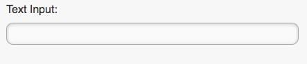

In many cases you may want to be able to group form elements together visually. This can be done utlizing a data attribute 'data-role="fieldcontain"'

----

	<label for="democontain">Textarea:</label>
	<textarea name="democontain" id="democontain"></textarea>

 
----

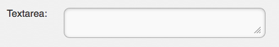

data- attributes::
[horizontal]
	data-mini;; 
		true or false (default) - shows the compact sized elements
	data-role;;
		none - prevents the enhancement of the element and utilizes the native element
	data-theme;;
		a-z - coordinates the elements theme to the matching style using the swatch identifier

.Search Input
Search inputs on your form are generated in a specific way by jQuery Mobile. You only need to create a label associated to an input type="search" in order to get the search input to render. The defaults are the same as the text inputs where the label will be stacked about the search input on your form.

----
<label for="searchinput">Search input:</label>
<input type="search" name="search" id="searchinput" />
----

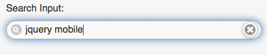

data- attributes::
[horizontal]
	data-mini;; 
		true or false (default) - shows the compact sized elements
	data-role;;
		none - prevents the enhancement of the element and utilizes the native element
	data-theme;;
		a-z - coordinates the elements theme to the matching style using the swatch identfier
	
.Slider
When you add an input type of range to your jQuery Mobile application, by default it will enhance to a touch-friendly slider. 

----
<label for="slider">Input Slider:</label>
<input type="range" name="slider" id="slider" value="42" min="0" max="100" />
----

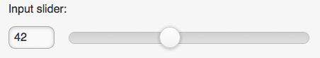

data- attributes::
[horizontal]
	data-highlight;;
		true or false (default) - adds a highlight to the slider
	data-mini;; 
		true or false (default) - shows the compact sized elements
	data-role;;
		none - prevents the enhancement of the element and utilizes the native element
	data-theme;;
		a-z - coordinates the elements theme to the matching style using the swatch identfier
	data-track-theme;;
		a-z - coordinates the track of the slider to the matching style using the swatch identifier

.Select Menus
As you build a select menu in your application, it will be styled like a jQuery Mobile button, but the menu itself defaults to the devices native menus. 

----
<label for="select-framework" class="select">Choose Framework:</label>
<select name="select-framework" id="select-framework">
   <option value="jquery">jQuery</option>
   <option value="jqueryui">jQuery User Interface</option>
   <option value="jquerymobile">jQuery Mobile</option>
   <option value="js">JavaScript</option>
</select>
----

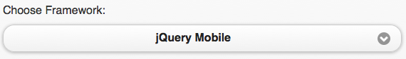

If you wish to override the native menu and utilize the custom select menu, you can set a custom data- attribute to do so on an individual select. If you wish to remove the native menus throughout your application you will need to set the nativeMenu option to false during jQuery Mobile initialization as follows:

----
$(document).bind('mobileinit',function(){
   $.mobile.selectmenu.prototype.options.nativeMenu = false;
});
----

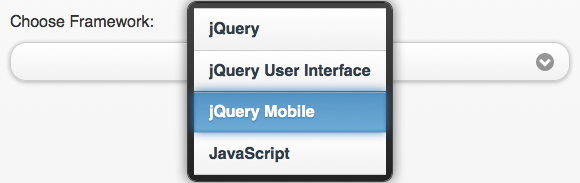

data- attributes::
[horizontal]
	data-icon;;
		any of - home, delete, plus, arrow-u, arrow-d (default),check, gear, grid, star, custom, arrow-r, arrow-l, minus, refresh, forward, back, alert, info, search, false 
	data-iconpos;;
		any of - left, right (default), top, bottom, notext
	data-inline;;
		true or false (default)
	data-mini;; 
		true or false (default) - shows the compact sized elements
	data-native-menu;;
		true (default) or false
	data-overlay-theme;;
		a-z - theme for custom select menus
	data-role;;
		none - prevents the enhancement of the element and utilizes the native element
	data-theme;;
		a-z - coordinates the elements theme to the matching style using the swatch identfier

.Flip Toggle Switch
A toggle is a special variation on the select list. This is created by adding the data- attribute "slider" to a select list of two items.

----
<label for="switch" class="select">Switch:</label>
<select name="switch" id="switch" data-role="slider">
   <option value="on">ON</option>
   <option value="off">OFF</option>
</select>
----

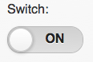

data- attributes::
[horizontal]
	data-mini;;
	 	true or false (default) - shows the compact sized element
	 data-role;;
	 	none - prevents the enhancement of the element and utilize the native
	 data-theme;;
	 	a-z - coordinates teh element's theme to the matching style using the swatch identifier
	 data-track-theme;;
	 	a-z - coordinates the track of the slider to the matching style using the swatch identifier

.Radio Buttons
Radio buttons within your form can be enhanced in two ways, vertical or horizontal groups. To group vertically, simply add them to a container marked with the data-role='controlgroup' attribute. To make them horizontal you need to add the data-type='horizontal' attribute as well.

vertical
----
<fieldset data-role="controlgroup">
	<legend>Choose a pet:</legend>
     	<input type="radio" name="radio-choice" id="radio-choice-1" value="choice-1" checked="checked" />
     	<label for="radio-choice-1">Cat</label>

     	<input type="radio" name="radio-choice" id="radio-choice-2" value="choice-2"  />
     	<label for="radio-choice-2">Dog</label>

     	<input type="radio" name="radio-choice" id="radio-choice-3" value="choice-3"  />
     	<label for="radio-choice-3">Hamster</label>

     	<input type="radio" name="radio-choice" id="radio-choice-4" value="choice-4"  />
     	<label for="radio-choice-4">Lizard</label>
</fieldset>
----

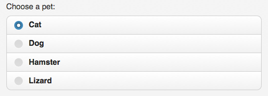

horizontal
----
<fieldset data-role="controlgroup" data-type="horizontal">
    <legend>Choose a pet:</legend>
         <input type="radio" name="radio-choice" id="radio-choice-1" value="choice-1" checked="checked" />
         <label for="radio-choice-1">Cat</label>

         <input type="radio" name="radio-choice" id="radio-choice-2" value="choice-2"  />
         <label for="radio-choice-2">Dog</label>

         <input type="radio" name="radio-choice" id="radio-choice-3" value="choice-3"  />
         <label for="radio-choice-3">Hamster</label>

         <input type="radio" name="radio-choice" id="radio-choice-4" value="choice-4"  />
         <label for="radio-choice-4">Lizard</label>
</fieldset>
----

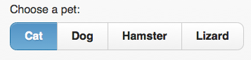

data- attributes::
[horizontal]
	data-mini;;
	 	true or false (default) - shows the compact sized element
	 data-role;;
	 	none - prevents the enhancement of the element and utilize the native
	 data-theme;;
	 	a-z - coordinates teh element's theme to the matching style using the swatch identifier

.Checkboxes
When you add an input type of checkbox to your form, it will be enhanced as well. However there are certain attributes you can add to your form which will allow grouping vertically and horizontally just as the radio buttons in the previous section.

----
<input type="checkbox" id="agree" name="agree" /><label for="agree">Agree</label>
----               

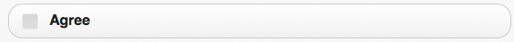

----
<fieldset data-role="controlgroup" >
    <input type="checkbox" id="agree" name="agree" /><label for="agree">Agree</label>
    <input type="checkbox" id="disagree" name="disagree" /><label for="disagree">Disgree</label>
</fieldset>    
----

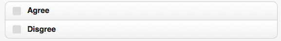

----
<fieldset data-role="controlgroup" data-type="horizontal">
    <input type="checkbox" id="agree" name="agree" /><label for="agree">Agree</label>
    <input type="checkbox" id="disagree" name="disagree" /><label for="disagree">Disgree</label>
</fieldset>
----

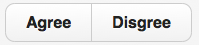

data- attributes::
[horizontal]
	data-mini;;
	 	true or false (default) - shows the compact sized element
	 data-role;;
	 	none - prevents the enhancement of the element and utilize the native
	 data-theme;;
	 	a-z - coordinates teh element's theme to the matching style using the swatch identifier

