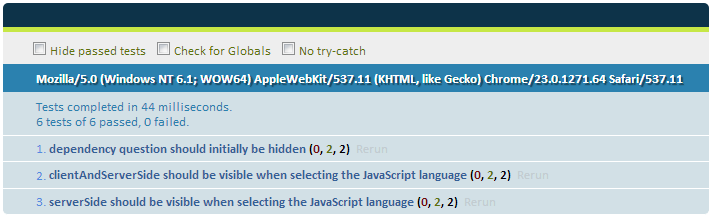
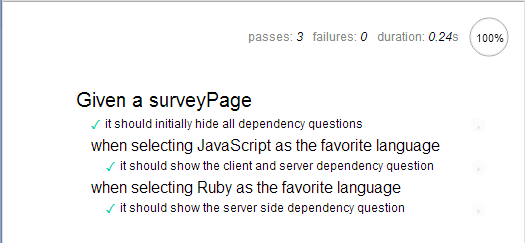

////

This recipe shows how to write automated unit tests for your jQuery Mobile application.

Author: Daniel Mohl <danmohl@gmail.com>

Bio: Daniel Mohl is a Microsoft MVP, F# and C# Insider, and author of the book entitled "Building Web, Cloud, and Mobile Solutions with F#". He blogs at blog.danielmohl.com and you can follow him on Twitter at twitter.com/dmohl.

////

8.4 Integrating Automated Unit Testing
~~~~~~~~~~~~~~~~~~~~~~~~~~~~~~~~~~~~~~

Problem
+++++++

You want to create automated unit tests for the custom JavaScript that makes up your jQuery Mobile application.   

Solution
++++++++

Before we begin, we need to set the stage with example JavaScript around which we wish to wrap automated unit tests. 
In the bonus section of chapter 5, recipe 5 a bit of JavaScript was shown that showcased a simple approach for dynamically 
displaying elements based on responses to other input elements on the page. As a refresher, here is the 
JavaScript that was shown in that recipe.

[source, javascript]     
----
$( document ).on( "pagebeforeshow", "#surveyPage", function() {
  var $page = $( this );    

  // Hide all dependency questions
  $page.find( ".toggleElement" ).hide();
  // Bind an event handler to the change JavaScript event to 
  // toggle the visibility of the dependency questions
  $( "input[name=favoriteLanguage]" ).change(function() {
    var $input = $( this ), 
      $page = $input.closest( "[data-role='page']" ),
      classToShow;

    // Hide all dependency questions
    $page.find( ".toggleElement" ).hide();
    // Get the value of the data-dependency-class attribute 
    classToShow = $input.data( "dependencyClass" );
    // Show the appropriate dependency question
    $page.find( "." + classToShow ).show();
  });
});
----

The easiest way to write automated unit tests for this JavaScript is to use one of the existing JavaScript testing frameworks such
as QUnit or Mocha. Let's start with QUnit, which is the framework used to test the code of both jQuery and jQuery Mobile. 

We first create the markup that will be used to setup the tests and display the results. The markup looks like this:

[source, html]
---

  

    

      <form action="#surveyCompletePage" method="get" data-ajax="false">
        <ul data-role="listview" data-theme="d" > 					
          <li>
            <label>Favorite Language:</label>
            <fieldset data-role="controlgroup">
              <input type="radio" name="favoriteLanguage" id="javaScript" value="javaScript" data-dependency-class="clientAndServerSide"/>
              <label for="javaScript">JavaScript</label>
              <input type="radio" name="favoriteLanguage" id="ruby" value="ruby" data-dependency-class="serverSide" />
              <label for="ruby">Ruby</label>
            </fieldset>
          </li>
          <li class="toggleElement clientAndServerSide">
            <label>Do you use this language for development on the:</label>
            <fieldset data-role="controlgroup" data-type="horizontal">
              <input type="radio" name="languageUse" id="usedForServerSide" value="usedForServerSide" />
              <label for="usedForServerSide">Server</label>
              <input type="radio" name="languageUse" id="usedForBoth" value="usedForBoth" />
              <label for="usedForBoth">Both</label>
            </fieldset>	
          </li>
          <li class="toggleElement serverSide">	
            <label>How many hours per week do you write server-side code?</label>
            

              <input type="range" name="serverSideCodingHours" id="serverSideCodingHours" value="0" min="0" max="100" />
            

          </li>					
        </ul>
      </form>
    

  

---

We can then write our unit tests in JavaScript as shown in the following example:

[source, javascript]
---
$(function() {
  var $page = $( "#qunit-fixture" ).find( "#surveyPage" );
	
  test( "dependency question should initially be hidden", 2, function() {
    // Make assertions  
    ok( $page.find( ".clientAndServerSide" ).is( ":hidden" ), "clientAndServerSide Check" );
    ok( $page.find( ".serverSide" ).is( ":hidden" ), "serverSide Check" );
  });	

  test( "clientAndServerSide should be visible when selecting the JavaScript language", 2, function() {
    // Select the JavaScript favorite language
    $page.find( "input[id=javaScript]" ).click();
    // Make assertions    
    ok( $page.find( ".clientAndServerSide" ).attr( "display" ) !== "none", "Visibility Check" );
    ok( $page.find( ".serverSide" ).is( ":hidden" ), "Hidden Check" );	 
  });	

  test( "serverSide should be visible when selecting the JavaScript language", 2, function() {
    // Select the Ruby favorite language
    $page.find( "input[id=ruby]" ).click();	  
    // Make assertions
    ok( $page.find( ".clientAndServerSide" ).is( ":hidden" ), "Hidden Check" );
    ok( $page.find( ".serverSide" ).attr( "display" ) !== "none", "Visibility Check" );
  });
});  	
---

The result of running this test is shown in Figure 1 and a jsFiddle for this example is available at http://jsfiddle.net/gh/gist/jquery/1.8.2/4182401/[jsFiddle].

[[FIG1]]
.QUnit Example

Discussion
++++++++++

The first thing worth discussing about the solution are the divs with ids qunit and qunit-fixture. The div with id qunit is used by the QUnit 
library to display the tests and associated results. The div with id qunit-fixture is used as a container for the markup that is to be used 
for testing purposes. It's important to place the test markup within this container in order to ensure that it doesn't display on the page. 
Additionally, QUnit will reset the innerHtml of this container div after each test is run. 

The actual unit tests include a number of aspects that are worth discussing. Let's start with the first line. This line shows a shorthand
approach equivalent to $( document ).ready(... This ensures that our tests don't attempt to run until the page has completely loaded. 

The next line defines a variable named $page and initializes it to a jQuery object that represents the element with id surveyPage. It's worth 
noting that we only search for #surveyPage within the element with id qunit-fixure. This is a best practice that helps to ensure 
that your tests are atomic. You can read more about this best practice and more in the [QUnit Cookbook](http://qunitjs.com/cookbook/).  

At this point we define 3 tests. The first test verifies that no dependency questions display when the form is initially shown.
The second test verifies that the "client and server-side" question displays as expected when "JavaScript" is selected as a favorite 
language. The third test verifies that the "server-side" question becomes visible when "Ruby" is selected as the favorite language. One thing to 
point out about these tests is the numeric value that is provided as the second argument to the test function. This numeric value 
specifies the number of assertions that are expected within the test. 

QUnit provides a lot of value, but it isn't the only option available for automated unit testing. In fact, there are so many options that
a whole other book could be written on this topic alone. In the interest of space, I will discuss only one other testing framework named Mocha. 

Mocha provides a flexible test framework with a number of features beyond those provided by QUnit. One of these features includes the option
to write your tests in a more readable style. This can make your tests easier to understand. It's also very easy to use various
assertion libraries with Mocha. Assertion libraries allow your tests to be even more readable. The following example shows our tests written 
with the BDD style for Mocha using expect.js as the assertion library.

[source, javascript]
---
$(function() {
  mocha.setup( "bdd" );
  var $page = $( "#fixture" ).find( "#surveyPage" );
 
  describe( "Given a surveyPage", function() {	   	    
    it( "it should initially hide all dependency questions", function() {
      // Make assertions
      expect( $page.find( ".clientAndServerSide" ).is( ":hidden" ) ).to.equal( true );
      expect( $page.find( ".serverSide" ).is( ":hidden" ) ).to.equal( true );
    });	

    describe( "when selecting JavaScript as the favorite language", function() {
      it( "it should show the client and server dependency question", function() {
        // Select the JavaScript favorite language
        $page.find( "input[id=javaScript]" ).click();
        // Make assertions
        expect( $page.find( ".clientAndServerSide" ).attr( "display" ) ).to.not.equal( "none" );
        expect( $page.find( ".serverSide" ).is( ":hidden" ) ).to.equal( true );	    
      });	
    });

    describe( "when selecting Ruby as the favorite language", function() {
      it( "it should show the server side dependency question", function() {
        // Select the Ruby favorite language
        $page.find( "input[id=ruby]" ).click();	  
        // Make assertions
        expect( $page.find( ".clientAndServerSide" ).is( ":hidden" ) ).to.equal( true );
        expect( $page.find( ".serverSide" ).attr( "display" ) ).to.not.equal( "none" );
      });
    });
  });
}); 	
---

The very readable result of running these tests is shown in Figure 2. A jsFiddle of this example is available at 
http://jsfiddle.net/gh/gist/jquery/1.8.2/4199725/[jsFiddle].

[[FIG2]]
.Mocha Example
